# SentinelBR — Diagramas Visuais (Mermaid)

> Diagramas renderizáveis em Mermaid (suportado nativamente pelo GitHub, GitLab e a maioria dos editores Markdown). Substituem os diagramas ASCII dos outros documentos por versões visuais, mais fáceis de compreender de relance.

---

## 📋 Sumário

1. [Como visualizar estes diagramas](#como-visualizar-estes-diagramas)
2. [Visão geral do sistema (Contexto C4)](#visão-geral-do-sistema-contexto-c4)
3. [Containers (componentes deployáveis)](#containers-componentes-deployáveis)
4. [Fluxo de evento (do log ao alerta)](#fluxo-de-evento-do-log-ao-alerta)
5. [Fluxo de bloqueio automático](#fluxo-de-bloqueio-automático)
6. [Modelo de dados — relacionamentos principais](#modelo-de-dados--relacionamentos-principais)
7. [Estados do alerta](#estados-do-alerta)
8. [Ciclo de vida do agente](#ciclo-de-vida-do-agente)
9. [Pipeline de processamento de eventos](#pipeline-de-processamento-de-eventos)
10. [Arquitetura de rede](#arquitetura-de-rede)
11. [Camadas de segurança](#camadas-de-segurança)
12. [Roadmap visual](#roadmap-visual)

---

## Como visualizar estes diagramas

Os diagramas estão escritos em **Mermaid**, uma linguagem de markup para diagramas. Eles renderizam automaticamente em:

- **GitHub** (em arquivos .md)
- **GitLab**
- **VS Code** com extensão "Markdown Preview Mermaid Support"
- **Notion**
- **Obsidian**
- **mermaid.live** (online, cole o código)

Se aparecer só código nas suas ferramentas, instale o plugin Mermaid.

---

## Visão geral do sistema (Contexto C4)

Como o SentinelBR se relaciona com usuários e sistemas externos.

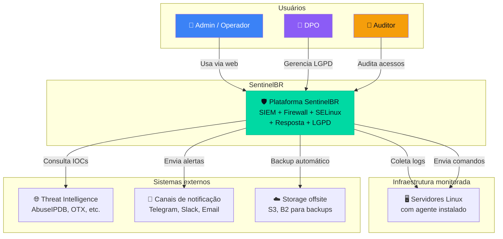

---

## Containers (componentes deployáveis)

Componentes que rodam em produção e como se conectam.

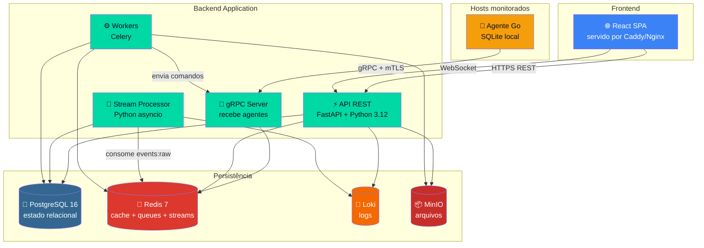

---

## Fluxo de evento (do log ao alerta)

Como uma tentativa de SSH falha vira alerta na UI.

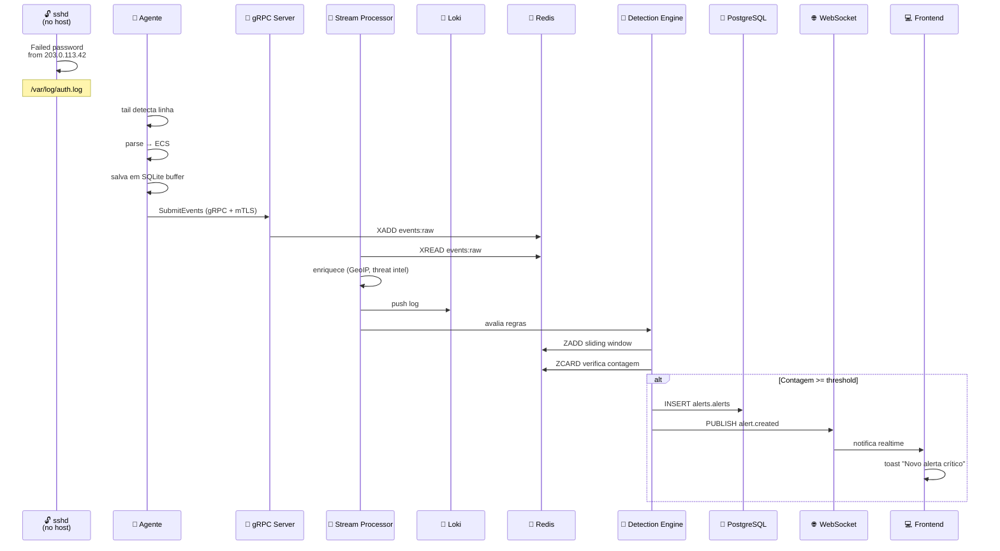

---

## Fluxo de bloqueio automático

Como um alerta dispara bloqueio de IP automaticamente.

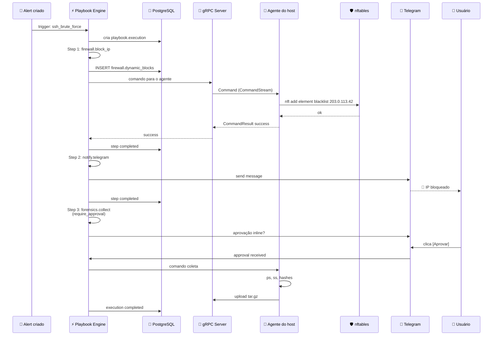

---

## Modelo de dados — relacionamentos principais

Como as principais tabelas do PostgreSQL se relacionam.

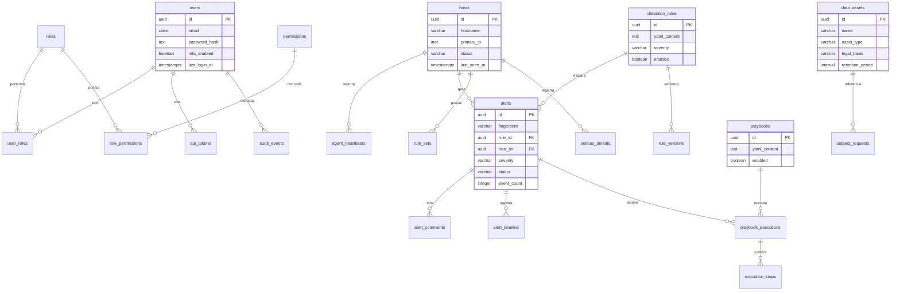

---

## Estados do alerta

Ciclo de vida de um alerta na plataforma.

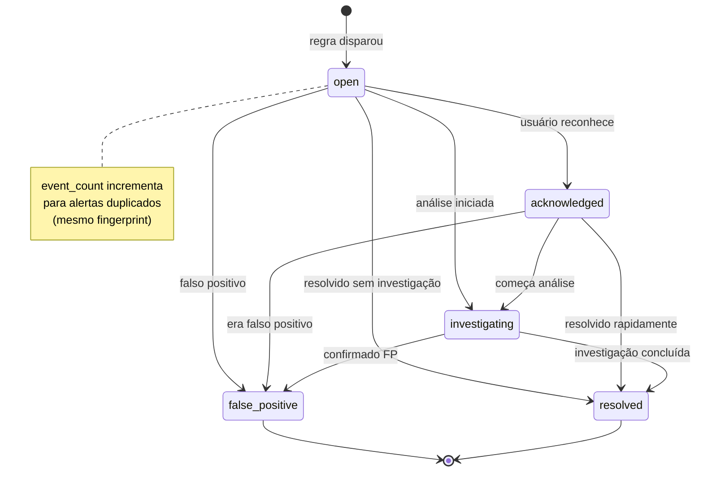

---

## Ciclo de vida do agente

Estados pelos quais o agente passa.

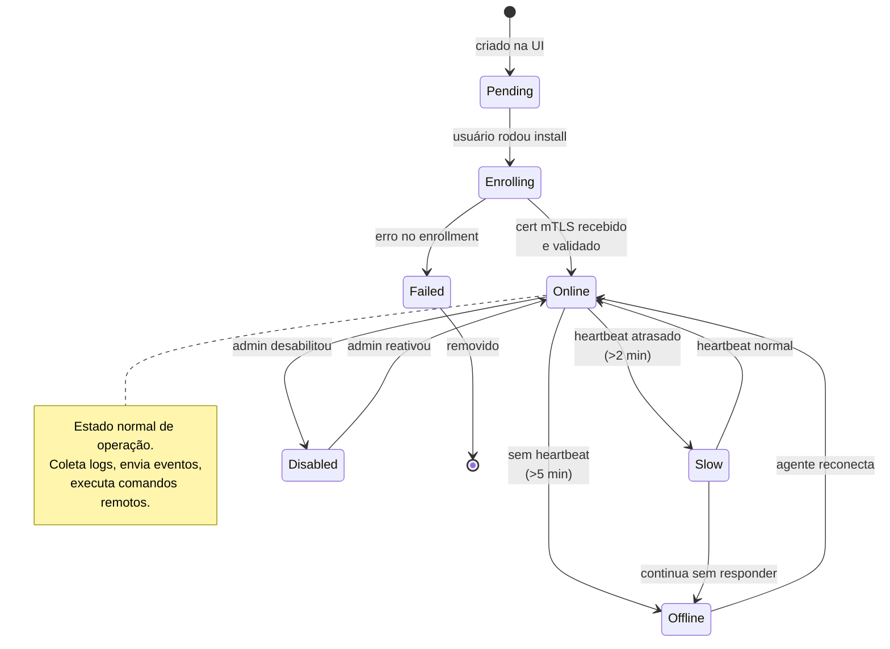

---

## Pipeline de processamento de eventos

Como eventos fluem pelos workers.

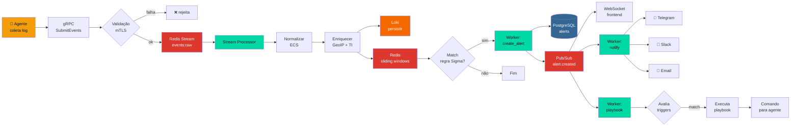

---

## Arquitetura de rede

Como os componentes se comunicam pela rede.

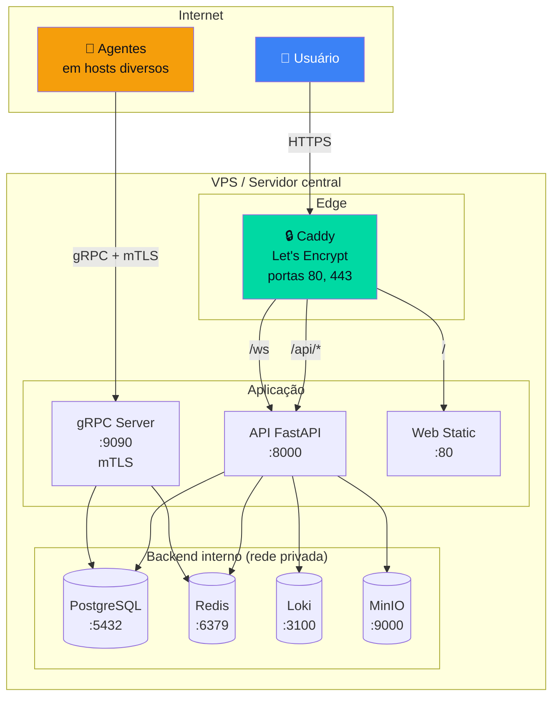

---

## Camadas de segurança

Defesa em profundidade da plataforma.

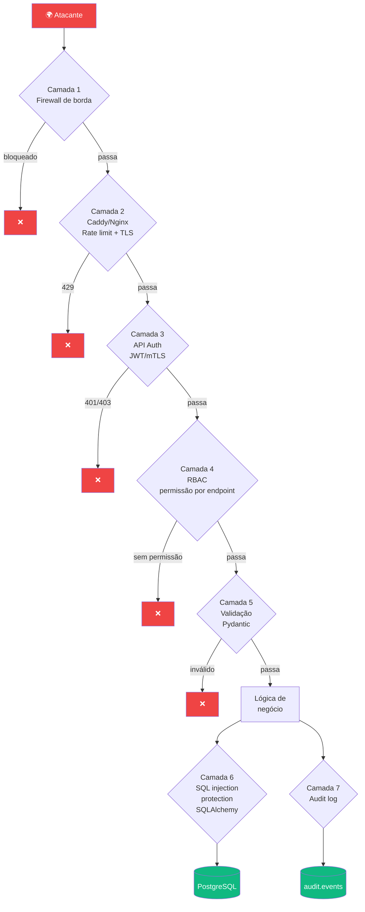

---

## Roadmap visual

Linha do tempo das fases do projeto.

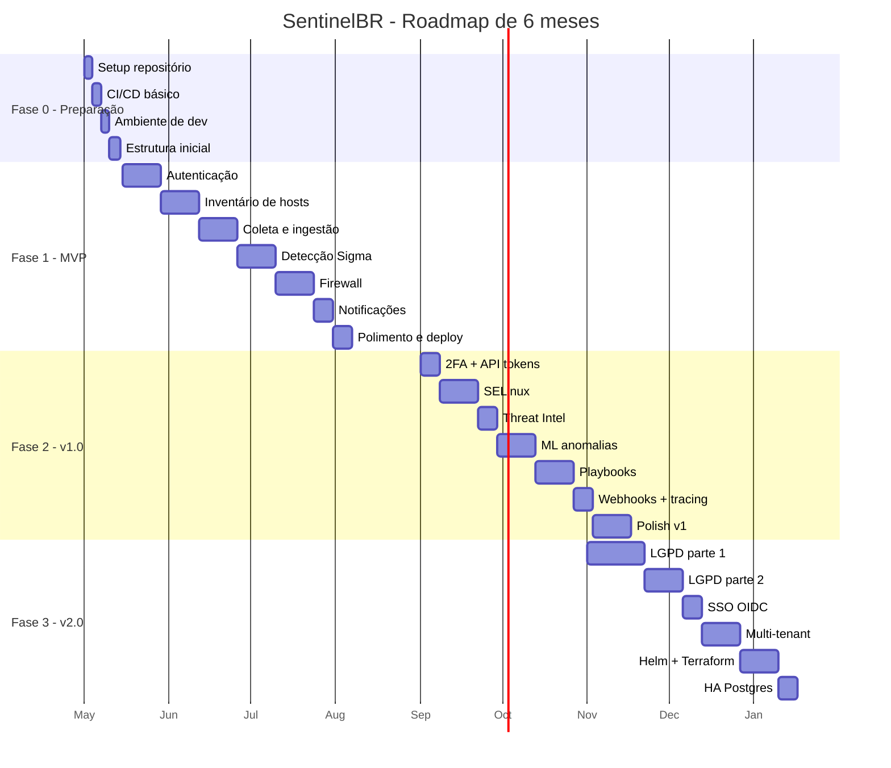

---

## Como editar e adicionar diagramas

Sempre que precisar adicionar diagrama novo:

1. Pense em **qual tipo melhor representa** o conceito:
   - `graph TB/LR`: relações entre componentes
   - `sequenceDiagram`: interações ao longo do tempo
   - `stateDiagram-v2`: estados e transições
   - `erDiagram`: modelo de dados
   - `flowchart`: fluxos de processo
   - `gantt`: cronogramas
   - `pie`: proporções
   - `journey`: jornada de usuário
   - `mindmap`: brainstorming

2. Use cores **consistentes** com o design system:
   - `#00D9A3`: brand (componentes principais)
   - `#3B82F6`: usuário/info
   - `#F59E0B`: warning/agente
   - `#EF4444`: danger/erro
   - `#10B981`: success
   - `#8B5CF6`: LGPD/compliance

3. Teste em mermaid.live antes de comitar

4. Mantenha **simples**: se diagrama tem >20 caixas, divida em dois

---

*Documento mantido por: [seu nome]  
Última atualização: 2026  
Versão: 1.0*
